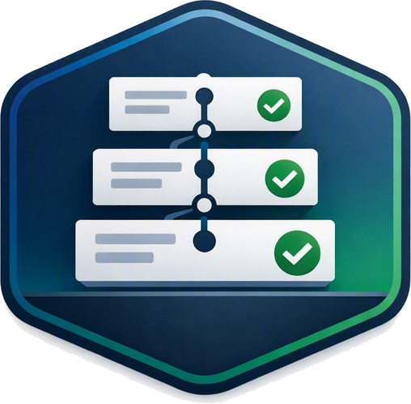
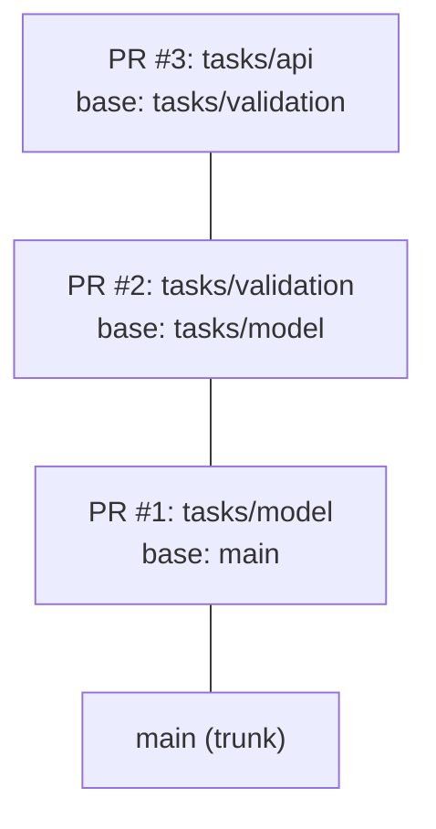
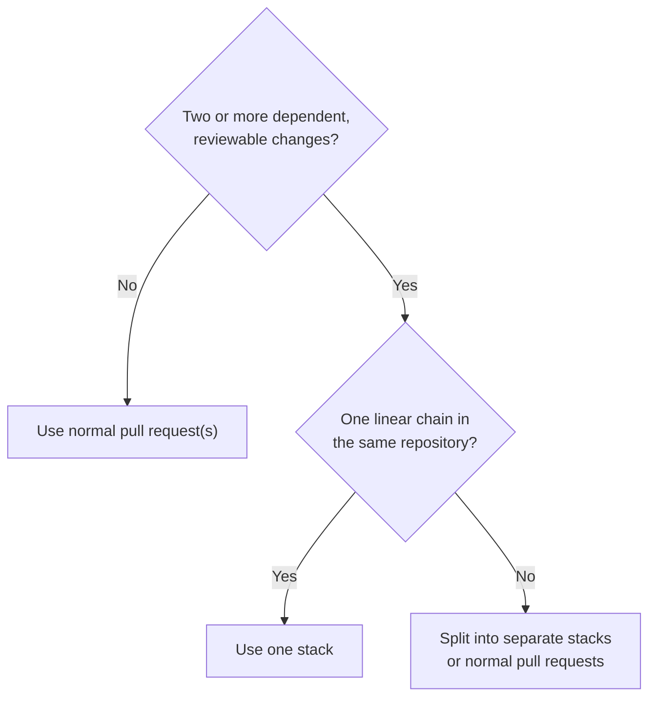

# Learn GitHub Stacked PRs

<p align="center">
  
</p>

Learn GitHub Stacked PRs through a live three-PR stack, a GitHub CLI walkthrough, and an AI coding agent workshop.

## Choose a path

- **5 minutes:** Learn [how stacked PRs work](#how-stacked-prs-work)
- **15 minutes:** [Review the live stack](docs/review-walkthrough.md)
- **45–60 minutes:** [Build the canonical stack using the GitHub CLI (gh)](docs/build-the-stack.md)
- **55 minutes:** Run the [AI coding agent workshop](docs/workshop/README.md)
- **Training:** Use the [PowerPoint deck](https://github.com/DanWahlin/learn-github-stacked-prs/raw/refs/heads/main/github-stacked-prs.pptx) and [facilitator guide](docs/facilitator-guide.md)

Keep the [`gh stack` cheat sheet](docs/cheat-sheet.md), [troubleshooting guide](docs/troubleshooting.md), and [glossary](docs/glossary.md) nearby after training.

## How stacked PRs work

Large dependent changes often force an awkward choice: open one large pull request, or wait for each smaller pull request to merge before starting the next. Stacked pull requests keep the changes small without making the work serial.

A stack is two or more pull requests in the same repository, arranged in a linear dependency chain. The bottom pull request targets the stack's trunk, and each pull request above it targets the branch directly below it.



Each pull request shows only the diff for its layer, while work can continue on the layers above it. When lower-layer decisions affect higher layers, review from the bottom up. Reviewers with different areas of expertise can also review separate layers in parallel.

Merge the lowest unmerged pull request by itself, or select a higher pull request to merge it and every unmerged layer below it. A mid-stack pull request cannot merge by itself.

### Decide whether to use a stack



GitHub stacks must be linear, and every branch in a stack must be in the same repository. Branching stacks and cross-fork stacks are not supported.

Examples:

- One task feature split into model → validation → API layers: one stack
- Independent authentication and billing changes: separate normal pull requests
- Authentication and billing changes that each have dependent layers: separate stacks

## Canonical live stack

The open pull requests in this repository provide a working stacked PR example for workshops and reviews:

| Layer | Pull request | Base ← head | Purpose |
| --- | --- | --- | --- |
| Model | [PR #21](https://github.com/DanWahlin/learn-github-stacked-prs/pull/21) | `main` ← `tasks/model` | Tested task model |
| Validation | [PR #22](https://github.com/DanWahlin/learn-github-stacked-prs/pull/22) | `tasks/model` ← `tasks/validation` | Tested title validation |
| API | [PR #23](https://github.com/DanWahlin/learn-github-stacked-prs/pull/23) | `tasks/validation` ← `tasks/api` | Tested task API |

Each pull request contains implementation and tests for its own behavior. The [training-resource workflow](https://github.com/DanWahlin/learn-github-stacked-prs/actions/workflows/verify-training-resource.yml) checks the documented pull request boundaries and runs the tests on every canonical branch.

## Hands-on requirements

The CLI walkthrough and workshop in this repository require:

- Git 2.20 or newer, with `user.name` and `user.email` configured
- Node.js 20 or newer
- GitHub CLI 2.90 or newer, authenticated to GitHub
- Permission to create and push to a GitHub repository
- The [`github/gh-stack`](https://github.com/github/gh-stack) extension

The repository-copy script works in PowerShell, Command Prompt, Bash, and Zsh. The manual CLI walkthrough uses Bash/Zsh syntax; on Windows, use WSL or Git Bash to run its commands unchanged.

Verify the setup:

```sh
git --version
git config user.name
git config user.email
node --version
gh --version
gh auth status
gh stack --version
```

If `gh stack --version` reports that `gh stack` is unavailable, install the extension once:

```sh
gh extension install github/gh-stack
```

## Create a learner repository

Use the copy script instead of a fork. A fork does not reproduce this repository's pull requests, reviews, checks, or stack relationship, and the workshop needs an isolated stack whose branches are all in the same repository.

```sh
git clone https://github.com/DanWahlin/learn-github-stacked-prs.git
node learn-github-stacked-prs/scripts/create-workshop-copy.mjs YOUR-OWNER/my-stacked-prs-workshop --build --private
```

Build mode lets learners create the stack. Ready mode recreates the complete canonical stack for facilitator rehearsal, shortened sessions, or recovery. See [Create a workshop repository](docs/workshop-copies.md).

## Learn with an AI coding agent

The root [`AGENTS.md`](AGENTS.md) gives coding agents the stack-selection rules, command contract, test boundaries, approval gates, and verification requirements.

The workshop supports:

- [GitHub Copilot](https://github.com/features/copilot) agent mode in a supported IDE
- [GitHub Copilot CLI](https://github.com/features/copilot/cli)
- [GitHub Copilot app](https://github.com/features/ai/github-app)

Other AI coding tools may be used after verifying that they load `AGENTS.md`, operate in the intended local repository, and can run Git, GitHub CLI, tests, and `gh stack`.

For the GitHub Copilot CLI path, install GitHub's official `gh-stack` agent skill at user scope before starting the workshop:

```sh
gh skill install github/gh-stack gh-stack --agent github-copilot --scope user
copilot skill list
```

The `gh-stack` skill provides reusable CLI guidance at user scope. `AGENTS.md` defines this repository's boundaries, approvals, and verification requirements. Follow the [AI coding agent workshop](docs/workshop/README.md) for the complete prompt sequence. See GitHub's [Stack AI-generated code in pull requests](https://docs.github.com/copilot/tutorials/stack-ai-generated-code-in-pull-requests) tutorial for the official skill-based workflow.

## Contributing

See [CONTRIBUTING.md](CONTRIBUTING.md). The repository is licensed under the [MIT License](LICENSE).
