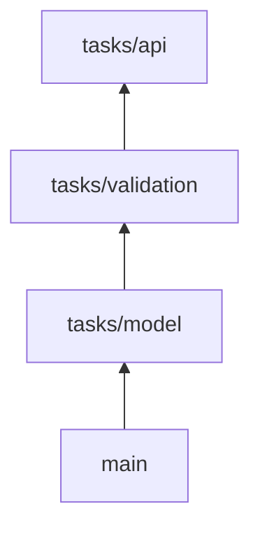

# Review the live stack

Use the open learning stack in [this repository](https://github.com/DanWahlin/learn-github-stacked-prs/pulls) for this walkthrough.

Treat the public stack as read-only. Inspect it, but do not push, synchronize, close, or merge its branches and pull requests.

## Stack graph

Every branch passes its tests. Each layer includes the tests for the behavior it introduces instead of deferring them to the top layer.

## Bottom PR: Tested task model

Open the pull request whose head branch is [`tasks/model`](https://github.com/DanWahlin/learn-github-stacked-prs/pulls?q=is%3Apr+head%3Atasks%2Fmodel).

Verify:

- Base: `main`
- Head: `tasks/model`
- Changed files: `src/tasks.js` and `test/tasks.model.test.js`
- Responsibility: Create a task with an ID, title, and incomplete state
- Acceptance: The model unit test passes

Review the domain shape before reviewing dependent validation or API behavior.

Sample review question:

> Does the task model expose the smallest useful contract for the layers above it?

## Middle PR: Tested validation

Open the pull request whose head branch is [`tasks/validation`](https://github.com/DanWahlin/learn-github-stacked-prs/pulls?q=is%3Apr+head%3Atasks%2Fvalidation).

Verify:

- Base: `tasks/model`
- Head: `tasks/validation`
- Changed files: `src/tasks.js` and `test/tasks.validation.test.js`
- Responsibility: Trim valid titles and reject missing or whitespace-only titles
- Acceptance: Model and validation tests pass

Sample review question:

> Should normalization and rejection both belong at this domain boundary?

## Top PR: Tested task API

Open the pull request whose head branch is [`tasks/api`](https://github.com/DanWahlin/learn-github-stacked-prs/pulls?q=is%3Apr+head%3Atasks%2Fapi).

Verify:

- Base: `tasks/validation`
- Head: `tasks/api`
- Changed files: `package.json`, `src/server.js`, and `test/tasks.api.test.js`
- Responsibility: Expose `POST /tasks` and translate domain failures into HTTP responses
- Acceptance: All unit and integration tests pass

Sample review question:

> Does the HTTP layer translate domain behavior without duplicating it?

## Tests and the stack

Keep each layer's behavior and tests in the same branch. The branch must pass its applicable tests before the next layer is created.

A tests-only bottom pull request stays red until the implementation arrives in a higher layer. That conflicts with required checks and makes the lower pull request impossible to review on its own.

## Review sequence

1. Review the tested model contract
2. Review validation against the approved model
3. Review the API against the approved domain behavior
4. Confirm that every branch passes its applicable tests
5. Merge only the approved portion of the stack, then verify the final GitHub state

## What a poor stack looks like

Stop and restructure when:

- A PR contains several unrelated responsibilities
- Tests are deferred to a separate layer even though lower behavior can fail independently
- A lower PR is intentionally red and cannot satisfy required checks
- Formatting or generated-file churn hides the functional change
- Reviewers cannot state the acceptance criterion for one layer
