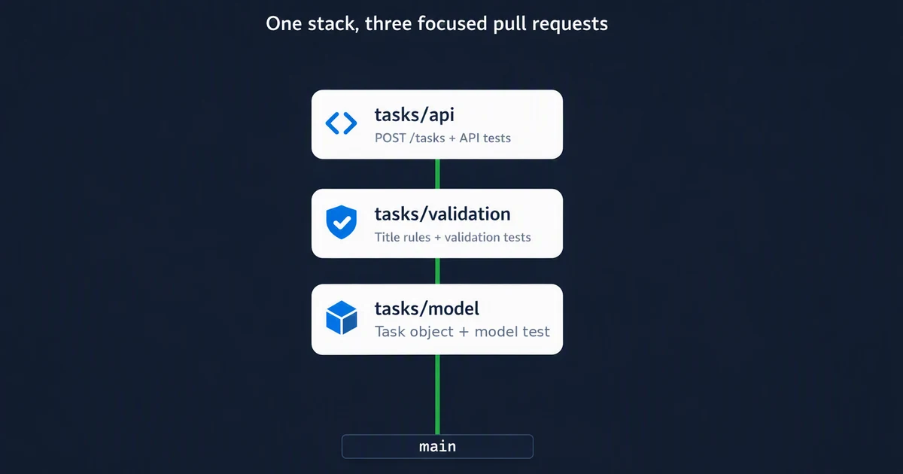
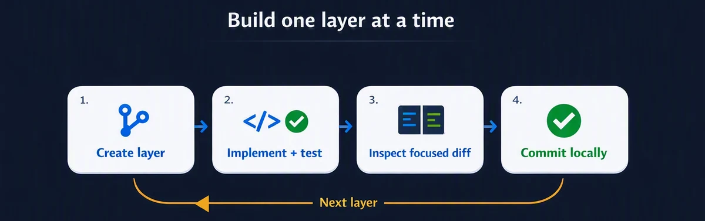
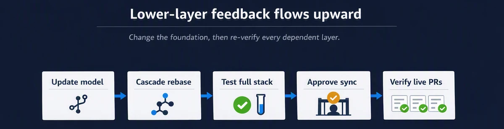

# Agentic stacked PRs workshop

Build the same three-layer stack shown in the canonical pull requests, using an AI coding agent while keeping a human in control of branch boundaries, tests, publication, and merge decisions.

The 60-minute workshop uses GitHub Copilot CLI or the [GitHub Copilot desktop app](https://github.com/features/ai/github-app). Other agentic coding tools can be used if they load `AGENTS.md` and can run the required terminal commands.

## Learning objectives

By the end of the workshop, learners can:

1. Decide whether work needs one stack, separate stacks, or a normal pull request.
2. Evaluate an agent-proposed stack before implementation.
3. Keep implementation and tests together in every layer.
4. Submit and verify the stack on GitHub.
5. Explain how lower-layer feedback affects dependent branches.

## Prerequisites

Run the shell commands from Bash or Zsh on macOS or Linux. On Windows, use Windows Subsystem for Linux (WSL) or Git Bash.

| Tool | Validation |
| --- | --- |
| Git 2.20 or newer | `git --version` |
| Node.js 20 or newer | `node --version` |
| GitHub CLI 2.90 or newer | `gh --version` and `gh auth status` |
| `github/gh-stack` | `gh stack --version` |
| GitHub Copilot CLI, desktop app, or another coding agent | Confirm that the agent can read the repository and run terminal commands |
| GitHub's `gh-stack` agent skill for the Copilot CLI path | Installed and verified in Lab 0 |

## Prework: create the learner repository

Do not fork the training repository. Create an isolated private repository in build mode:

```sh
git clone https://github.com/DanWahlin/learn-github-stacked-prs.git

learn-github-stacked-prs/scripts/create-workshop-copy.sh \
  YOUR-OWNER/my-stacked-prs-workshop \
  --build \
  --private
```

The copy includes `AGENTS.md` but not the canonical training branches or pull requests. Run the workshop from the new repository directory. If repository creation is not completed as prework, allow 5–10 additional minutes.

## Workshop map

| Lab | Topic | Time |
| --- | --- | --- |
| 0 | Verify the agent and instructions | 5 minutes |
| 1 | Plan and approve the stack | 10 minutes |
| 2 | Build three tested layers | 20 minutes |
| 3 | Verify, submit, and inspect | 10 minutes |
| 4 | Respond to lower-layer feedback | 10 minutes |
| 5 | Team adoption discussion | 5 minutes |

Use a disposable learner repository. Do not run these labs in the public training repository.

## Lab 0: Verify the agent and instructions

Run from the learner repository root:

```sh
git status --short --branch
gh auth status
gh stack --version
```

### GitHub Copilot CLI

Install GitHub's official skill once at user scope. This keeps the learner repository clean when the workshop checks `git status`:

```sh
gh skill install github/gh-stack gh-stack --agent github-copilot --scope user
copilot skill list
```

Start Copilot CLI from the learner repository root:

```sh
copilot
```

Run `/instructions`, Copilot CLI's view for custom instruction files, and verify that `AGENTS.md` is loaded.

The skill covers `gh stack` commands. `AGENTS.md` defines the workshop's stack, test boundaries, approval gates, and required evidence. Check that the agent loaded both.

### GitHub Copilot desktop app

Open the learner repository in the desktop app. Start a session in the **local repository** so the agent operates on the same branches and stack metadata used by the workshop. Reference `@AGENTS.md` in the first prompt.

The app also supports isolated working-tree and cloud-sandbox sessions. Those modes are useful for parallel work, but the local-repository mode keeps this guided exercise simple.

### Other coding agents

The `gh skill install` command supports multiple agent hosts through `--agent`. Installing the skill is recommended when the selected agent supports skills, but it is not required for the baseline lab. Verify that the agent loads `AGENTS.md`, can run Git and `gh stack`, and can stop before remote operations.

### Instruction check

Enter:

```text
Read AGENTS.md. Do not modify files.

Summarize when to use one stack, which operations require approval, and what
evidence you must return before submitting pull requests.
```

Compare the response with `AGENTS.md`. Stop if the agent misses an approval boundary or verification requirement.

## Lab 1: Plan and approve the stack

### Scenario

Build the same dependency chain as the canonical training stack:

<p align="center">
  
</p>

Enter this planning prompt:

```text
Read AGENTS.md and inspect the repository. Do not modify files.

Plan this stacked change:

- tasks/model creates task objects with an ID, title, and completed=false.
- tasks/validation trims valid titles and rejects missing or blank titles.
- tasks/api adds a runnable POST /tasks endpoint with success and error responses.

Return the trunk, branches ordered bottom to top, responsibility and exclusions
for each pull request, tests for each layer, exact gh stack commands, and final
verification commands. Wait for approval before implementation.
```

Approve the proposal only when:

- The order is `main → tasks/model → tasks/validation → tasks/api`.
- Every layer includes its own tests.
- The model and validation layers exclude API code.
- The first command is `gh stack init --base main tasks/model`.
- The agent stops before pushing, submitting, synchronizing, or merging.

## Lab 2: Build three tested layers

<p align="center">
  
</p>

Use the same implementation prompt once for each row, from top to bottom in this table:

| Branch | Parent | Files | Responsibility | Expected cumulative tests |
| --- | --- | --- | --- | --- |
| `tasks/model` | `main` | `src/tasks.js`, `test/tasks.model.test.js` | Add `createTask` and its model test | 1 passing test |
| `tasks/validation` | `tasks/model` | `src/tasks.js`, `test/tasks.validation.test.js` | Trim valid titles and reject missing or blank titles, with tests | 4 passing tests |
| `tasks/api` | `tasks/validation` | `package.json`, `src/server.js`, `test/tasks.api.test.js` | Add `POST /tasks`, `npm start`, and API integration tests | 6 passing tests |

For the first layer, use `gh stack init --base main tasks/model`. For later layers, use `gh stack add <branch>`.

```text
Implement only <branch> above <parent>.

1. Create the approved stack layer.
2. Implement only the approved behavior and add its tests.
3. Run npm test.
4. Inspect the diff against the parent branch.
5. Commit the implementation and tests together.

Stop after the local commit. Do not push, submit, synchronize, or merge.
```

After each layer, verify:

```sh
npm test
gh stack view --json
git diff --stat <parent>..<branch>
```

Do not create the next layer until the current layer is green and focused.

## Lab 3: Verify, submit, and inspect

Ask the agent for evidence before approving publication:

```text
Do not change files or perform remote operations.

Return gh stack view --json, branch ancestry, the base, head, commit, and changed
files for every planned pull request, test results for every layer, and the full
npm test result from tasks/api. Report any deviation or unverified assumption.
```

Compare the result with the canonical boundaries:

| Pull request | Base | Head | Changed files |
| --- | --- | --- | --- |
| Model | `main` | `tasks/model` | `src/tasks.js`, `test/tasks.model.test.js` |
| Validation | `tasks/model` | `tasks/validation` | `src/tasks.js`, `test/tasks.validation.test.js` |
| API | `tasks/validation` | `tasks/api` | `package.json`, `src/server.js`, `test/tasks.api.test.js` |

After the facilitator approves submission, run or authorize:

```sh
gh stack submit --auto --open
```

Inspect the live pull requests. Verify that all three are open, ready for review, correctly based, focused, and linked as one stack. Command exit status alone is not proof of success.

## Lab 4: Respond to lower-layer feedback

Practice a specific lower-layer change: add `priority: 'normal'` to every task and assert that default in `test/tasks.model.test.js`.

<p align="center">
  
</p>

1. Run `gh stack bottom`.
2. Update the model and its test with the new `priority` default.
3. Run the model tests and commit the correction.
4. Inspect `gh stack view --json`.
5. Get approval before `gh stack rebase`.
6. Run the full tests from `tasks/api` and inspect every diff.
7. Get approval before `gh stack push` or `gh stack sync`.
8. Inspect every live pull request after the update.

Use `gh stack rebase --abort` if conflict resolution is uncertain. Stop rather than choosing a source of truth when local and remote stack definitions diverge.

## Lab 5: Team adoption discussion

Use the [team playbook](../team-playbook.md) to agree on:

1. What qualifies for a stack.
2. Maximum stack size.
3. Required tests per layer.
4. Review order and stack ownership.
5. Who may rebase, synchronize, and merge.
6. How the team handles independent workstreams.

## Completion criteria

The learner can:

- Explain why the three branches form one dependency chain.
- Show that the agent used the repository instructions.
- Evaluate the agent's plan rather than accepting it blindly.
- Show one focused, green diff per pull request.
- Verify live bases, heads, files, readiness, and stack linkage.
- Explain which operations require human approval.
